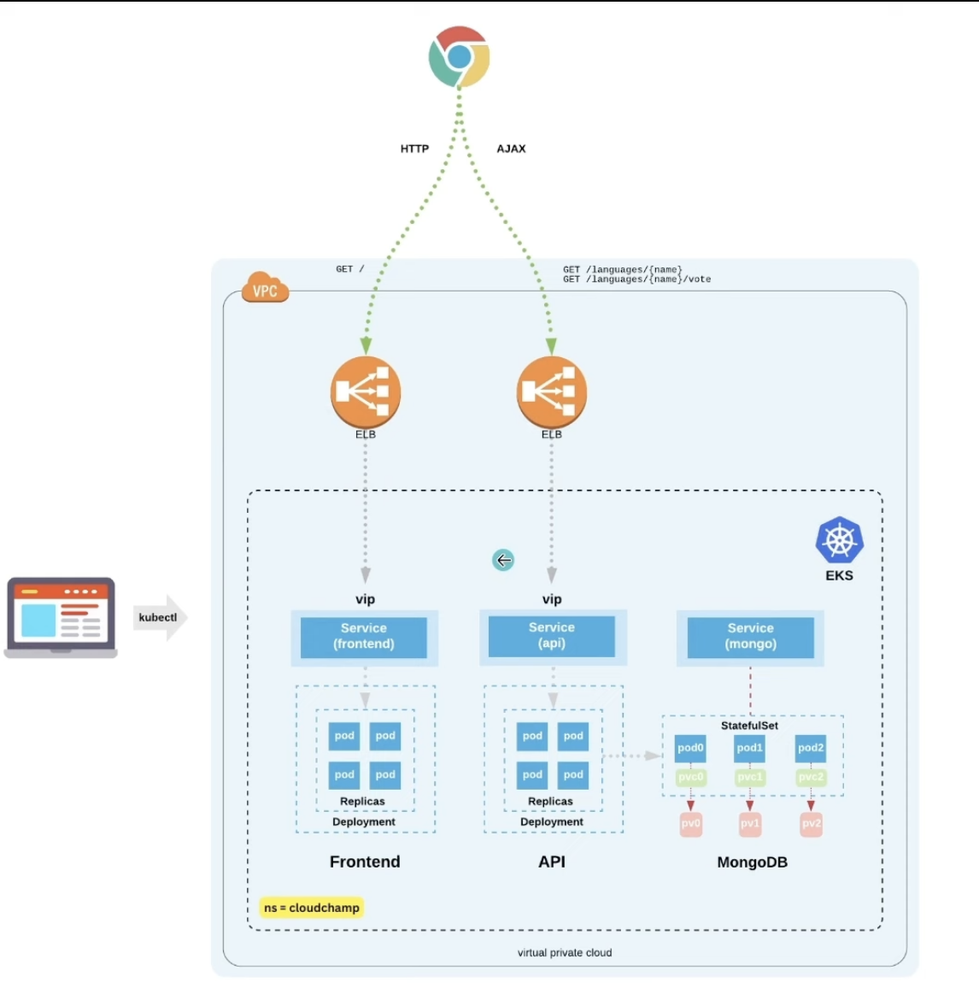

----

# Project Overview

This project involves setting up and deploying a MongoDB-backed application on an Amazon EKS (Elastic Kubernetes Service) cluster. The setup includes configuring the EKS cluster, deploying MongoDB using StatefulSets, creating a RESTful API to interact with the MongoDB database, and deploying a frontend application. The entire process ensures that the application is scalable and resilient, leveraging Kubernetes' capabilities.

# Architecture

1. **EKS Cluster**: The backbone of the deployment, providing a managed Kubernetes environment.
2. **MongoDB**: Deployed using StatefulSets for persistence and high availability.
3. **API**: A RESTful service to interact with the MongoDB database.
4. **Frontend**: A user interface to interact with the API and display data.

### Setup and Deployment Process

#### 1. Create EKS Cluster and Add-ons

- **EKS Cluster Creation**:
  - Create an EKS cluster.
  - Add the following add-ons: Amazon VPC CNI, kube-proxy, Amazon EKS Pod Identity Agent, CoreDNS, and Amazon EBS CSI Driver.

- **Create EC2 Instance for EKS Access**:
  - Create an instance named `EKS-Server`.
  - Attach the `EKSAccess` Instance profile role.

#### 2. Install Tools on the EC2 Instance

- **Install kubectl**:
  ```sh
  curl -O https://s3.us-west-2.amazonaws.com/amazon-eks/1.24.11/2023-03-17/bin/linux/amd64/kubectl
  chmod +x ./kubectl
  sudo cp ./kubectl /usr/local/bin
  export PATH=/usr/local/bin:$PATH
  ```

- **Install AWS CLI**:
  ```sh
  curl "https://awscli.amazonaws.com/awscli-exe-linux-x86_64.zip" -o "awscliv2.zip"
  unzip awscliv2.zip
  sudo ./aws/install
  ```

- **Connect EKS Cluster to kubectl**:
  ```sh
  aws eks update-kubeconfig --name Cluster-1 --region us-east-1
  ```

- **Configure ConfigMap**:
  ```sh
  kubectl edit configmap aws-auth -n kube-system
  ```

#### 3. Deploy MongoDB

- **Deploy MongoDB using StatefulSet**:
  ```sh
  kubectl apply -f mongo-statefulset.yaml
  ```

- **Ensure Persistent Volumes**: Verify that MongoDB pods have persistent volumes.

- **Create MongoDB Service**:
  ```sh
  kubectl apply -f mongo-service.yaml
  ```

- **Initialize Replica Set**:
  ```sh
  kubectl exec -it mongo-0 -- mongo
  rs.initiate();
  sleep(2000);
  rs.add("mongo-1.mongo:27017");
  sleep(2000);
  rs.add("mongo-2.mongo:27017");
  sleep(2000);
  cfg = rs.conf();
  cfg.members[0].host = "mongo-0.mongo:27017";
  rs.reconfig(cfg, {force: true});
  sleep(5000);
  ```

- **Create Database**:
  ```sh
  use langdb;
  db.languages.insert({"name" : "csharp", "codedetail" : { "usecase" : "system, web, server-side", "rank" : 5, "compiled" : false, "homepage" : "https://dotnet.microsoft.com/learn/csharp", "download" : "https://dotnet.microsoft.com/download/", "votes" : 0}});
  db.languages.insert({"name" : "python", "codedetail" : { "usecase" : "system, web, server-side", "rank" : 3, "script" : false, "homepage" : "https://www.python.org/", "download" : "https://www.python.org/downloads/", "votes" : 0}});
  db.languages.insert({"name" : "javascript", "codedetail" : { "usecase" : "web, client-side", "rank" : 7, "script" : false, "homepage" : "https://en.wikipedia.org/wiki/JavaScript", "download" : "n/a", "votes" : 0}});
  db.languages.insert({"name" : "go", "codedetail" : { "usecase" : "system, web, server-side", "rank" : 12, "compiled" : true, "homepage" : "https://golang.org", "download" : "https://golang.org/dl/", "votes" : 0}});
  db.languages.insert({"name" : "java", "codedetail" : { "usecase" : "system, web, server-side", "rank" : 1, "compiled" : true, "homepage" : "https://www.java.com/en/", "download" : "https://www.java.com/en/download/", "votes" : 0}});
  db.languages.insert({"name" : "nodejs", "codedetail" : { "usecase" : "system, web, server-side", "rank" : 20, "script" : false, "homepage" : "https://nodejs.org/en/", "download" : "https://nodejs.org/en/download/", "votes" : 0}});
  ```

#### 4. Deploy the API

- **Create MongoDB Secret**:
  - Create a secret to register an admin and a password for MongoDB.

- **Deploy API**:
  ```sh
  kubectl apply -f api-deployment.yaml
  ```

- **Expose API with LoadBalancer**:
  ```sh
  kubectl expose deployment api --name=api --type=LoadBalancer --port=80 --target-port=8080
  ```

- **Test API**:
  ```sh
  curl -s $API_ELB_PUBLIC_FQDN/languages | jq .
  ```

#### 5. Deploy the Frontend

- **Deploy Frontend Application**:
  ```sh
  kubectl apply -f frontend-deployment.yaml
  ```

- **Expose Frontend with LoadBalancer**:
  ```sh
  kubectl apply -f frontend-service.yaml
  ```

### Summary

This project demonstrates how to set up a full-stack application using Kubernetes on AWS EKS. The deployment includes configuring the cluster, deploying a MongoDB database with StatefulSets, creating a RESTful API, and deploying a frontend application. Each component is designed to be scalable and resilient, leveraging Kubernetes' orchestration capabilities.

